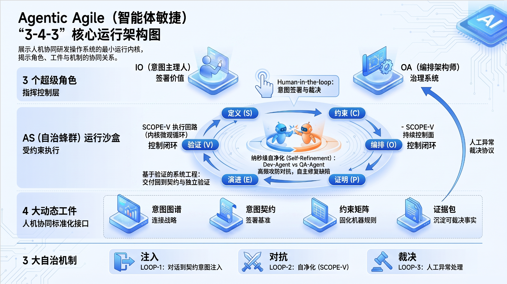

# Agentic Agile 3-4-3

> 让 AI 交付可治理、可追溯、可验证。

Agentic Agile 3-4-3 是一套面向 Agentic AI 研发的治理 Skill，帮助团队建立意图、约束、验证和证据闭环。



- 官网：<http://agentic.iloveagile.me/>
- 方法论白皮书：<https://github.com/elegant1998/Agentic-Agile-Whitepaper>
- 作者：王立杰（无敌哥）
- 发布说明：[`RELEASE_NOTES.md`](RELEASE_NOTES.md)（[English](RELEASE_NOTES.en.md)）

## 下载与安装

所有 release ZIP 都在 [`download/`](download/) 目录。下载最新的
`Agentic-Agile-343-v*.zip`，再解压到对应工具的 `skills` 目录。
ZIP 已包含顶层目录 `agentic-agile-343`，不要重复嵌套或改名。

### Codex

```bash
mkdir -p ~/.codex/skills
unzip -q download/Agentic-Agile-343-v*.zip -d ~/.codex/skills
```

### Claude Code

```bash
mkdir -p ~/.claude/skills
unzip -q download/Agentic-Agile-343-v*.zip -d ~/.claude/skills
```

### Cursor

```bash
mkdir -p ~/.cursor/skills
unzip -q download/Agentic-Agile-343-v*.zip -d ~/.cursor/skills
```

### WorkBuddy

```bash
mkdir -p ~/.workbuddy/skills
unzip -q download/Agentic-Agile-343-v*.zip -d ~/.workbuddy/skills
```

安装后重启对应工具。若使用项目级 Skill，将 `~/.工具名/skills` 换成项目内对应的 `.工具名/skills`。

## 关于作者与社区

王立杰（无敌哥），AI 治理架构师、研发效能顾问，《敏捷无敌》《京东敏捷实践指南》作者。

- 官网：<http://agentic.iloveagile.me/about>
- 微信：`iloveagile` · Email：3433839@qq.com
- 在线课程：<http://agentic.iloveagile.me/>

欢迎在官网签署《Agentic Agile 宣言》，加入先锋社区。
