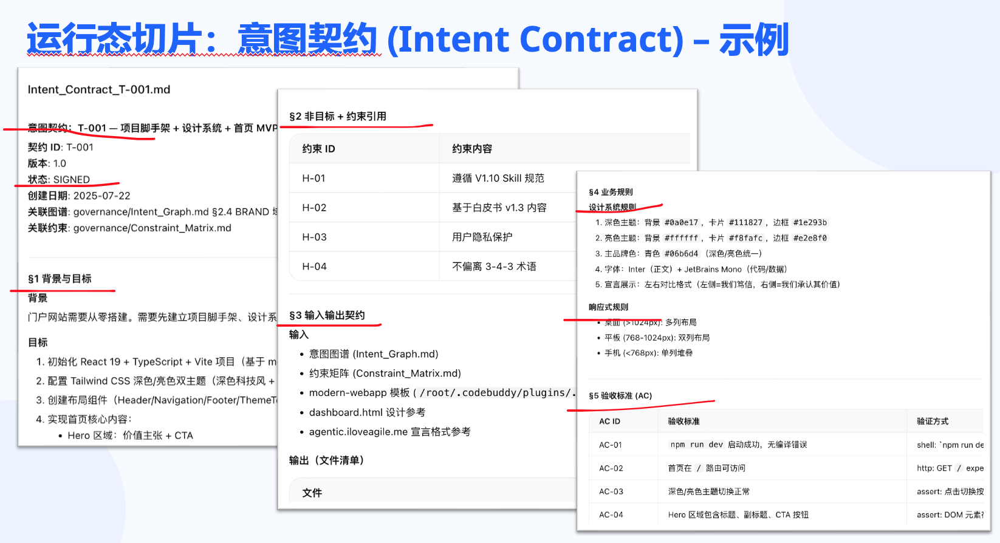
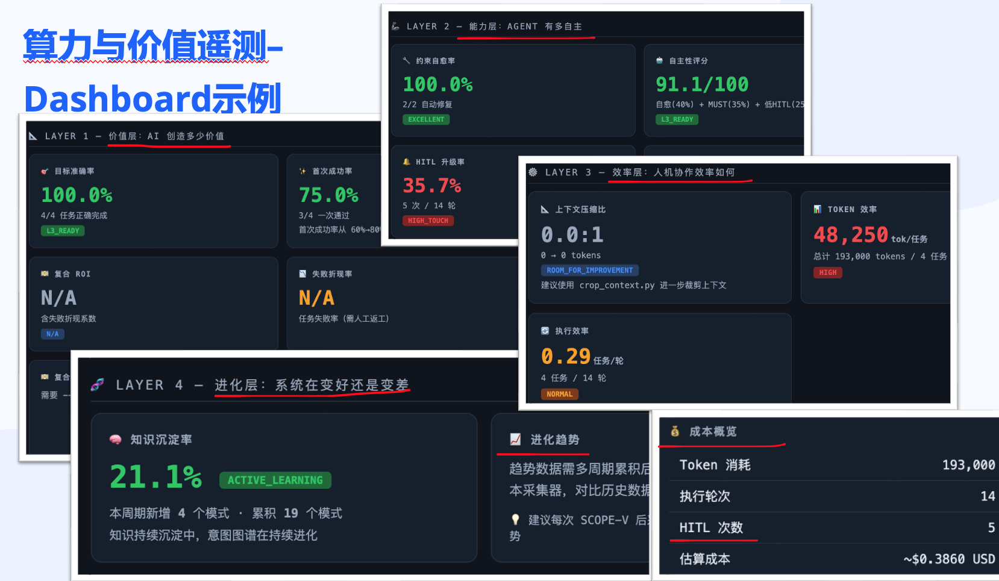
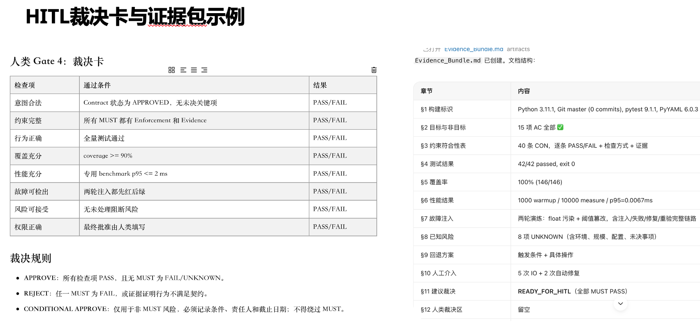

# 《Agentic Agile 智能体敏捷白皮书》
**—— 从“碳基协作”到“硅基自治”的AI研发治理新范式**

*作者 王立杰*   

*2026年5月*

## 序言：从“氛围编程”到“验证工程”的范式跃迁 (From Vibe Coding to Verified Engineering)
传统敏捷（Agile）的底色是一场“人类认知带宽的妥协”。不论是 Scrum 的迭代切分、Kanban 的在制品（WIP）限制，还是 SAFe 的火车式对齐，其第一性原理都在于：**人类大脑多线程处理能力极差、人际沟通符合邓巴数递减规律、人类的情绪与精力极易衰竭**。

2024 年以来的 Agentic AI（自治智能体）技术突破，彻底击穿了这些生理物理限制。早期的 AI 辅助开发主要停留在**“氛围编程/提示语编程 (Vibe Coding)”**——开发者打开对话框，丢出一个 Prompt，看着 Agent 生成代码，然后再通过反复对话来修补那些预期之外的诡异行为（Emergent behavior）。

但正如微软在关于  Agentic AI 的洞察中所指出的血淋淋的现实：**“这根本不是模型能力的问题，而是流程控制体系的问题。哪怕你升级到再强大的模型，也无法解决由于缺乏验收标准带来的系统性坍塌。一个更聪明的智能体面对一份模糊的规格说明书，只会产生更高级的逻辑偏离（Sophisticated drift），而不是减少错误。”**

对于高并发、可自动验证、上下文变化频繁的研发场景，传统敏捷正在逼近其有效边界。今天，我们正式提出 **Agentic Agile（智能体敏捷）**——一种以意图为中心、以多智能体高频对抗为引擎、以算力为基础的新一代管理架构。我们不仅是在重新定义敏捷，更是在响应业界从随性的“Vibe Coding（氛围编程）”向严格的“Verified Engineering（经过验证的严肃系统工程）”演进的时代呼唤。

---

## 一、理论基石：构建于三大科学领域的第一性原理

Agentic Agile 并非管理学的生搬硬套，它的底层逻辑是对认知科学、控制论与系统论在 AI 时代的第一性原理进行深度重构。

### 1. 认知科学（Cognitive Science）：突破“碳基认知带宽”极限
*   **第一性原理**：人类大脑的工作记忆（Working Memory）存在严苛的容量瓶颈（米勒的魔法数字 7±2），且跨个体协同受制于邓巴数（Dunbar's Number，即人类智力允许维持的稳定社交网络联系人数上限，150人限制）。
*   **传统敏捷痛点**：传统敏捷通过在制品限制（WIP Limits）、将任务拆分为微小的用户故事（Story Decomposition），本质上都是在**向人类认知极限妥协**，试图通过“化减截流”来保护极度稀缺的碳基带宽。
*   **Agentic 升维**：实现了“执行域”与“意图域”的大脑外包与彻底剥离。多智能体网络作为超级外部认知器官，承担了维系海量全局上下文、复杂逻辑推演、语法生成的繁重任务。人类的认知带宽不再被琐碎逻辑挤占，而是进化为纯粹的“意图锚定系统（Intent Anchoring）”，从而突破邓巴数限制，实现规模化的无界、无通信损耗协作。

### 2. 控制论（Cybernetics）：从“慢速滞后反馈”到“纳秒级自校准闭环”
*   **第一性原理**：控制论奠基人诺伯特·维纳指出，一切稳态系统的维系必须依赖“反馈机制”来消除偏差系统，且控制系统的精准度直接取决于反馈周期的短频与摩擦力。
*   **传统敏捷痛点**：Scrum 的迭代回顾会（Sprint Review）或每日站会（Daily Standup），本质上是周期长达 24 小时乃至 2 周以上的“慢速人肉控制闭环”。这种严重滞后的反馈机制，面对瞬息万变的不确定性，犹如驾驶一辆刹车系统延迟了 10 秒的汽车。
*   **Agentic 升维**：废止了人为设定的反馈周期，引入 **“高频对抗自校准（High-Frequency Adversarial Swarming & Self-Refinement）”**。开发智能体与测试/安全智能体在毫秒乃至纳秒级的时间窗内，通过机器接口进行连绵不断的：代码生成 → 漏洞注入 → 逻辑验证 的自动化对抗。这种超越人类感知极限的内循环微反馈，将偏差控制在几秒萌芽内，实现了真正意义上的负反馈自动驾驶机制。

### 3. 系统论（System Theory）：用“并发涌现”吞噬“系统复杂度”
*   **第一性原理**：依据系统论学者阿什比提出核心理论——阿什比法则（Ashby's Law of Requisite Variety，即“只有多样性才能吸收多样性”），控制系统的多样性能力必须等于或大于被控对象的复杂多样性。
*   **传统敏捷痛点**：面对日益庞大、交织如乱麻的现代软件系统，传统敏捷采用的是消极的“降维防守策略”——砍掉需求、设立护栏排期等待、组件硬隔离等，因为碳基组织架构的复杂度一旦升高就会迅速致使效能协同坍塌。
*   **Agentic 升维**：与其消极防守，不如主动“升维打击”。依托智能体间基于 API 的自组网能力与云端海量并发算力，瞬间唤醒成千上万的平行 Agent，形成非线性的“群体智能涌现（ Emergent Agent Swarming）”。以算力无限延展系统底层的必要多样性，形成高维对低维的绝对压制，直接“吞噬”并消解原本让人类团队窒息的系统复杂性。

---

## 二、核心哲学：Agentic Agile 宣言

对标并超越 2001 年的《敏捷软件开发宣言》，我们提出智能时代敏捷组织的五大核心价值观。我们承认右侧内容的价值，但我们更笃信左侧事物的力量：

1. **意图锚定（Intent Anchoring）** 胜过 详尽规约（Detailed Specifications）
   *(机器善于补全细节，人类的价值在于定义“去哪里”而非“怎么去”)*
2. **多模态涌现协作（Multimodal Emergent Swarming）** 胜过 跨职能人类团队（Cross-functional Teams）
   *(智能体网络的毫秒级 API 对抗，彻底取代低效的人类跨部门会议)*
3. **算法规则与架构韧性（Algorithmic & Arch Resilience）** 胜过 流程纪律与仪式（Process & Ceremonies）
   *(让机器自动施加约束代码审查，而不是指望人类的 Scrum Master 来监督)*
4. **实时遥测与闭环对抗（Real-time Telemetry & Adversarial Loop）** 胜过 阶段性复盘（Retrospective Meetings）
   *(从两周一次的反思，进化为纳秒级的运行态调整与机器自学习)*
5. **基于验证的系统工程（Verified Engineering）** 胜过 随性提示与氛围编程（Prompting & Vibe Coding）
   *(拒绝大模型黑盒狂欢，拥抱可追溯的 SDLC、Skill 模块化抽象与 Self-Refinement 机制)*

##### 如果你认同本文的内容，[请点击此处签署《Agentic Agile 宣言》](http://agentic.iloveagile.me/)并加入我们的先锋社区！

---

## 三、结构剖析：Agentic Agile 的“3-4-3 治理架构”

Agentic Agile 的落地骨架则是**“3个超级角色、4个动态工件、3大自治运行机制”**。没有任何多余的仪式会议，只有持续涌现的价值。


### 📌 3 个超级角色 (The 3 Roles)
在 Agentic Agile 中，组织结构被极度折叠，“中间层”被彻底抹平。

1. **意图主理人（Intent Owner, IO）**
   * **前身**：Product Owner (PO) / 业务发起人
   * **重塑**：不再需要编写事无巨细的 User Story 和 AC（验收标准）。IO 的角色转向“高维降维”，负责输入业务上下文、市场假设、北极星指标约束条件。IO 必须具备卓越的“提问能力”和“宏观判断力”。
2. **编排架构师（Orchestrator Architect, OA）**
   * **前身**：Scrum Master (SM) / 架构师 / PMO
   * **重塑**：从“管人”变为“管机器”。OA 不再以“写 Prompt”的熟练度定义价值，而是承担真正的 **Agentic Engineering（智能体工程）**职责：设计契约机制、维护约束矩阵、编排运行时工作流、分配 Agent 算力（Token 预算），并在系统出现漂移、死循环或证据不足时进行治理介入。
3. **自治蜂群（Autonomous Swarm, AS）**
   * **前身**：开发、测试、运维、设计等跨职能 Scrum 团队
   * **重塑**：一个完全数字化的微服务化编队。包含 PM-Agent、Dev-Agent、QA-Agent、Ops-Agent等。它们不是不可预测的统计概率黑盒，而是挂载了具体专属 Skill（技能模块）的确定性执行体。依托类似 David Yicheng Wei 提出的 `agentic-engineering-framework`，系统可以获得开箱即用的通用 Workflow、可扩展的项目私有知识、以及强大的智能体间协同能力，支持 24 小时并发工作与实时自我反思进化。

### 📌 4 个动态工件 (The 4 Artifacts)
告别线性文档与表格，拥抱图谱结构与代码即逻辑的工件。

1. **意图图谱（Intent Graph）**
   
   * **取代：Product Backlog。** 人类阅读是线性的表单（如 Jira 列表），但大模型更适合图形化读取。意图图谱是一个包含业务目标、用户画像、历史沉淀的三维向量知识库，系统实时从中抽取需要被解决的最优图谱节点。
   
   * **示例形态**：不再是 `作为用户，我想要...以便于...` 的孤立卡片，而是系统可解析的节点网络：
     
     ```mermaid
     graph TD
        A[战略北极星: 闪电贷上线且单笔欺诈损失<50元] --> B(业务图谱: 闪电贷核心交易流)
        A --> C(硬性约束: 信用分低于700直接熔断)
        A --> F(用户画像: 25-35岁/信用分700+/高频网购偏好)
        F --> B
        B --> D{当前状态: Dev-Agent 实时推演中}
        C --> E[历史上下文: 关联2025年3月大面积反欺诈攻击复盘]
     ```
     
   * **生成机制 (How it is Generated)**：
     
     * **拒绝人工连线**：IO（意图主理人）绝不需要拿画图工具去手动绘制这些节点。
     * **多模态模糊注入 (Multimodal Ingestion)**：IO 仅需向系统抛出原始的商业画布草图、PRD文本、甚至是核心高管会议的一段录音/文字纪要。
  * **Graph-RAG 自动化构建**：系统的“业务解析 Agent”会自动提取非结构化信息中的核心实体（人物画像、北极星目标、业务红线），并利用 Graph-RAG（图谱检索增强生成）技术，自动与企业过往踩坑记录、历史知识库进行交叉映射，瞬间组装出这张专门喂给底层 Agent 网络进行导航的图谱。
    
   * **运行态切片：意图契约（Intent Contract）**：

     * 意图图谱是全局的“宏观导航地图”；而当某一特定任务被澄清并准备执行时，系统会从全局图谱中“冻结并剪裁”出一份极度收敛的 **意图契约（Intent Contract）**。它直接锁定该次动作的明确目标、非目标和成功标准，等同于从繁杂的 Product Backlog 中切分并冻结出了单次具体任务的 Sprint Backlog，是后续所有自动化验证引擎防线的唯一基准。意图契约是为了执行当前这个“增量特性”而专门生成的；它不是发散的，而是极度结构化的。所以，必须包含确定的：业务目标、成功标准、非目标（Non-goals，不做什么）、风险边界。
     
        

2. **约束矩阵（Constraint Matrix）与系统外化指令**
   
   * **取代：DoD（完成定义）与架构规范。** 一段人类与 Agent 约法三章的硬编码防御策略。规定了预算（Token 消耗上限）、合规（不允许调用的危险 API）、安全标准和响应延迟阈值。在实践中，它是下沉到代码仓库中的机器可读文件（如 `.github/copilot-instructions.md`, `CLAUDE.md`, `STYLE.md`），将流程与标准彻底文档化。
   * **示例形态**：部署在 Agent 运行沙箱周边的 YAML/JSON 配置文件（Guardrails）：
     
     ```yaml
     # 智能体全局约束矩阵 (Harness Guardrails)
     budget_limits:
       max_tokens_per_intent: 500,000
       max_adversarial_loops: 5  # 防止红蓝对抗陷入死循环
     compliance_red_lines:
       forbidden_modules: ["db.drop", "payment.bypass"]
       data_privacy: "MASK_ALL_PII" # 强制敏感数据脱敏
     escalation_protocol:
       # 突破预算或触碰法务禁区时，立即阻断并呼叫 OA/IO 裁决
       trigger_human_in_the_loop: TRUE 
     ```
3. **涌现式增量（Emergent Increment）**
   
   * **取代：Sprint 潜在可交付增量。** 系统不再每两周产出一个版本，而是以分钟为单位产出。每次变更后通过 QA-Agent 验证，通过即刻转变为可运行的微切片，版本周期彻底消亡。
4. **算力与价值遥测（Compute & Value Telemetry）**
   
   * **取代：燃尽图（Burndown Chart）。** 展示当前的 Agent 并发数、Token 消耗率、机器自愈修复的错误率（AI 纠错比率）、以及用户端行为数据的闭环转化。不是测算“工作量进度”，而是测算“算力的业务转化率”。
   
   

### 📌 3 大自治运行机制 (The 3 Autonomous Run-time Mechanisms)
摒弃时间盒（Timebox）、计划会、站会、评审会、回顾会。一切以“高频并发（Concurrency）”和“事件驱动（Event-Driven）”代替会议与固化的流转。在这里，我们全面引入了 SCOPE-V 的核心工程控制论思想，将随意的“探索性聊天”真正转化为严肃的工业级产出。

1. **意图注入（Intent Ingestion）与“对话到契约机制（Conversation-to-contract Gate）”**
   
   * IO 随时在系统抛出新的意图，自然语言引擎实时解析并与“意图图谱”比对。为了防止大模型的随机性导致工程质量灾难，我们在这个环节设立了**“对话到契约机制（Conversation-to-contract gate）”**。它将早期非正式的“探索性对话（Vibe Coding）”与后续严肃的“代码生成”彻底隔离。只有当意图达到确定性阈值，系统才会生成包含需求与约束边界的契约，瞬间向下“散布”并唤醒相关的 Agent 群组。
2. **高频对抗与自净化闭环（High-Frequency Adversarial Swarming & Self-Refinement）**
   * 大模型不可避免会犯错，消除幻觉的方式不是靠人类 Review，而是靠**机器对抗与自我审查**。一个 Dev-Agent 写代码时，会生成附属的 QA-Agent 同时开展自动化测试与安全渗透。它们在沙盒内进行纳秒级的攻防对抗，并遵循 **SCOPE-V 循环（Specify 设定 -> Constrain 约束 -> Orchestrate 编排 -> Prove 证明 -> Evolve 演进 -> Verify 验证）**。
   * 这个微观执行循环通过高频触发 **自我提炼/净化（Self-Refinement）机制** 自主修复代码缺陷。这一机制直接支撑了 **Agentic Agile** 中所要求的验证工程（Verified Engineering），人类在这一阶段完全“离线（Out-of-the-loop）”。
3. **人类异常裁决协议（HITL Escalation Protocol）与“证据包验收（Evidence-Bundle Acceptance）”**
   * 系统唯一需要“沟通”的时刻。发生在以下情况：(1) Agent 推演发现所需算力超过预算约束；(2) 遇到无法从系统环境获取授权的决策；(3) 业务方向出现严重逻辑互斥。系统在此刻暂停分支，呼叫 IO 或 AO 进行降级的人类裁决（Human-in-the-loop）。
   * 即便是人类接管与验收，也不再是简单地 review 代码，而是基于机器生成的**证据包（Evidence-bundle）**（包含测试通过率记录、安全拦截日志、算力消耗凭证等）进行一次性宏观审批（Approve）。人类只为最终的验证证据买单。
   
   

---

## 四、降维革命：Agentic Agile 为什么会在特定场景下替代传统敏捷？

基于前置的系统复杂性理论，**阿什比法则（Ashby's Law）**指出：“只有多样性才能吸收多样性”。
传统主流敏捷方法论在应对当今系统复杂性时，往往通过**管理降维**（人为限制在制品、切分时间盒、拉平信息）来控制风险。而在“需求变化快、验证可自动化、上下文规模大、机器可并发协同”的软件场景下，Agentic Agile 通过**算力升维（模型、工具与运行时编排的并发）**获得明显优势。它不是对所有场景的统一替代，而是在满足前提条件时，对传统敏捷形成压倒性的效率与控制优势。

| 方法论/框架 | 核心底层假定 | 应对复杂性的手段 | 致命瓶颈（在今天） | Agentic Agile 的降维暴击机制 |
| :--- | :--- | :--- | :--- | :--- |
| **Scrum** | 人类需要免受打扰的“心流”与固定节拍保障产出。 | 时间盒（Sprint），2-4周锁定范围。 | 无法应对黑天鹅事件，人为制造排队和批量交付等待。 | 机器不需要心流，算力支持毫无切换成本的**实时响应中断与无损上下文恢复**。 |
| **Kanban** | 人类多任务处理极易出错，局部阻塞会导致全局瘫痪。 | 在制品限制（WIP Limits），看板可视化拉动。 | 受限于最慢的那个人类节点（木桶效应），通常是 QA 环节。 | 当验证链路可自动化时，瓶颈可以通过**快速扩展并发 Agent**显著缓解，而非长期排队消化。 |
| **XP (极限编程)**| 高复原力的修改来自工程师极致的技术纪律（TDD/结对）。| 强制的人类纪律和搭档互查。 | 极难长期维持，依赖少数精锐英雄，成本极高。 | 在测试、静态检查、沙箱执行充分自动化时，Agent 可以**持续执行高频结对式验证与回归**。 |
| **SAFe** / LeSS | 百人以上团队沟通呈现非线性爆炸，需要重装甲管理。 | PI 规划会议、发版火车、多层级 PO/SM/RTE 图谱。 | 官僚化、反应迟缓、为了对齐而耗费大量产能。 | 在共享工件、契约机制与统一约束矩阵下，Agent 协同的**边际沟通损耗远低于人类多层级组织**。 |

---

## 五、落地演进阶梯：组织如何向 Agentic Agile 跃迁？

没有企业能一键切换到 100% 的智能体敏捷。我们定义了组织的 **四阶段自治成熟度模型（Autonomy Maturity Model, AMM）**。

### 5.1 四级总览

| 等级   | 名称                               | 一句话                           |      |
| ------ | ---------------------------------- | -------------------------------- | ---- |
| **L1** | 工具依附期（Copilot Agile）        | AI 是个人外骨骼                  |      |
| **L2** | 人机编队期（Hybrid Agentic Scrum） | AI 是虚拟同事，仍吃主流程        |      |
| **L3** | 受控自治期（Constrained Autonomy） | 3-4-3 接管边界清晰、可验证的工作 |      |
| **L4** | 自治超进化（Full Agentic Agile）   | 意图驱动闭环，人批核心策略与风险 |      |

------

### 5.2 L1：工具依附期（Copilot Agile）

- **现状**：保持现有 Scrum / Kanban / 瀑布式等流程基本不变。协作、排期、验收仍依赖人工会议与人工文档。

- **动作**：引入代码补全、需求/文档草稿生成、单点问答。AI 附着在**单个员工**身上，是效率外骨骼，不是项目组里的「虚拟同事」。

- **治理特征**：无统一意图契约；无跨角色约束矩阵；无面向交付的 Agent 证据链。

- **典型遥测画像（参考）**：任务级遥测稀疏；首次成功率与自愈率不具备组织级统计意义。

- **跃迁信号（进入 L2）**：开始把可拆分任务**显式交给 AI 执行并回收结果**，而非仅在 IDE 里接受补全建议。

------

### 5.3 L2：人机编队期（Hybrid Agentic Scrum）

- **现状**：智能体以「虚拟员工 / 执行单元」身份进入项目组。人类仍主导迭代目标、优先级与对外承诺。

- **动作**：将一部分**边界清晰**的基础任务（单元测试、简单 CRUD、报表抽取、文档整理等）通过任务系统、对话工具或工作图（Work Graph）分发给 Agent。每日站会可弱化「纯信息同步」（由工具汇总状态），**保留障碍暴露与决策同步**。

- **说明**：不绑定某一品牌的工作流工具；关键是「任务可派发、结果可回收」，而非必须使用 Jira。

- **治理特征**：开始出现任务说明与检查清单，但往往缺少可执行约束与门禁；证据仍零散。

- **典型遥测画像（参考）**：有一定任务完成记录；人机往返次数偏高；MUST 类约束尚未系统化。

- **跃迁信号（进入 L3）**：引入 **IO / OA / AS** 分工，并让**契约—约束—证据**成为默认交付方式，而非偶发实验。

------

### 5.4 L3：受控自治期（Constrained Autonomy）

- **现状**：**执行权**从「会议驱动」转向「契约���约束驱动」。传统 Scrum 仪式可保留、可裁剪，但**不再是唯一治理中枢**——关键门禁由约束矩阵、证据包与 HITL 裁决承担。

- **动作**：落地 **3-4-3 架构**。原 PO 类角色更多以 **IO（意图主理人）** 提出假设与边界；资深工程师等以 **OA（编排架构师）** 维护契约、约束、运行与证据验收；**AS（自治蜂群）** 在护栏内完成代码生成、测试与修复。Agentic Agile **仅接管**边界清晰、验证完备、风险可控的生成 / 测试 / 发布类任务。

- **说明**：不以「必须彻底废弃 Scrum」为意识形态门槛。若组织仍使用看板或冲刺，但 **意图契约、约束门禁、证据裁决** 已成常态，即可认定为进入 L3。

- **治理特征**：

  1. 存在可追溯的意图契约（任务级或等效工件）；

  1. 存在可执行或可审计的约束（含安全与质量底线）；

  1. 关键交付有证据包或等效验收记录；

  1. 角色职责可指认（谁拍板意图、谁守门禁、谁执行）。

- **运行遥测门槛（建议窗口：连续 ≥10 个已完成任务，或等效周期）**：

  - 首次成功率 ≥ 70%；

  - MUST 类约束失败率 ≈ 0（允许有记录的例外与修复闭环）；

  - 运行自主性得分（0–100）建议 ≥ 60（能力层综合分，含自愈、MUST 通过率、HITL 负担等）；

  - 无未关闭的高危安全项（或已有书面例外）。

------

### 5.5 L4：自治超进化（Full Agentic Agile）

- **现状**：向「意图即软件（Intent as Software）」演进——观测、意图调整与实现闭环显著缩短；人类工作重心移至**商业策略与 AI 治理**，而非逐行审码或逐会排期。

- **动作**：意图图谱与运行态（含发布证据、质量与业务信号）深度耦合。当数据表明目标偏离时，分析侧可提出意图调整建议，开发侧在约束内快速重构相关能力；人类在核心决策与风险敞口上 **Approve / Reject**。项目管理编制可大幅收缩，转化为「策略团队」与「AI 治理团队」。

- **可测化说明**：

  - **不把**「秒级自动改生产且零人审批」作为 L4 硬门槛；

  - **要求** HITL 以**价值与风险裁决**为主，而非默认逐任务人工返工；

  - **要求** 意图 / 契约 / 约束随交付持续反哺；发布与回滚路径可证明；

  - 生产写权限等不可逆操作仍须权限隔离与审批策略（与安全底线一致）。

- **运行遥测门槛（建议窗口：连续 ≥10 个任务，且含生产相关或高风险任务样本）**：

  - 目标准确率 ≥ 90%；

  - 约束自愈率 ≥ 80%；

  - 运行自主性得分建议 ≥ 80；

  - 低 HITL 连续段可统计（例如连续 N 个任务无「因能力不足导致的」强制升级）；

---

## 六、最小落地蓝图：如何在 90 天内试出真伪？

如果 Agentic Agile 只能停留在概念层，它就只是另一套关于 AI 的修辞。真正的落地，必须从**小范围、强约束、可验证**的试点开始。

### 1. 试点准入条件（Pilot Entry Criteria）
建议组织只在同时满足以下条件时启动首个试点：

*   **任务边界清晰**：优先选择内部工具、BFF 服务、自动化脚本、报表服务、营销实验等边界明确的场景，而非核心交易主链路。
*   **验证链路存在**：至少具备基础 CI、自动化测试、静态检查、沙箱环境与回滚机制。
*   **业务 Owner 在场**：必须存在可持续响应的 IO，确保意图不是一次性输入后长期失真。
*   **仓库上下文可管理**：代码仓库具备最基本的 README、模块说明、权限边界与依赖治理文档。
*   **合规风险可隔离**：试点范围不直接触碰支付清结算、核心风控、隐私主数据、生产数据库写权限等高风险区域。

### 2. 最小角色责任矩阵（Minimal Governance Matrix）

| 工件/动作 | Responsible | Accountable | Consulted | Informed |
| :--- | :--- | :--- | :--- | :--- |
| 意图契约（Intent Contract）批准 | IO 起草 / 修订 | IO | 业务、架构、安全 | AS |
| 约束矩阵（Constraint Matrix）维护 | OA | OA | 安全、法务、平台 | IO、AS |
| 智能体执行与验证 | AS | OA | QA、安全 | IO |
| HITL 升级裁决 | OA 触发 | IO 或指定审批人 | 法务、架构、安全 | AS |
| 证据包验收 | OA 汇总 | IO | QA、平台 | 相关干系人 |

### 3. 最小工件闭环（Minimum Artifact Loop）
首个试点不需要“大而全”，但必须至少具备以下 5 个工件：

1. **Intent Contract**：明确业务目标、成功标准、非目标、风险边界。
2. **Constraint Matrix**：明确权限、预算、禁区 API、数据合规与升级条件。
3. **Execution Log**：记录 Agent 的计划、调用工具、关键决策与失败原因。
4. **Evidence Bundle**：沉淀验收所需证据，而不是只交付代码 diff。
5. **Telemetry Dashboard**：至少看到吞吐、成本、失败率、升级率与回滚率。

### 4. HITL 触发条件（Mandatory Escalation Rules）
以下情况必须触发人类异常裁决协议，而不是继续让 Agent 自主迭代：

*   **契约不完整**：成功标准缺失、非目标未定义、边界条件冲突。
*   **预算异常**：Token、执行时长或工具调用次数连续超阈值。
*   **证据不足**：测试未覆盖关键路径，或验收证据无法支撑上线结论。
*   **权限越界**：涉及未授权系统、生产写权限、敏感数据访问。
*   **目标互斥**：增长、成本、合规、安全之间出现无法自动求解的冲突。

### 5. 证据包的最低组成（Minimum Evidence Bundle）
一份可进入审批环节的 Evidence Bundle，最低应包含：

*   **需求与非目标摘要**：本次变更解决什么，不解决什么。
*   **测试与验证结果**：单测、集成测试、回归测试、静态扫描结果。
*   **运行日志摘要**：关键工具调用、失败重试、升级节点。
*   **风险与回退方案**：已知风险、灰度策略、回滚条件。
*   **成本记录**：执行轮次、算力消耗、人工介入次数。

### 6. 90 天试点路径（90-Day Pilot Path）

*   **0-30 天**：仅允许 Agent 处理低风险、强验证任务，建立契约模板、约束模板与证据包模板。
*   **31-60 天**：扩大到单服务级重构与自动化测试生成，开始测量升级率、验证一次通过率与单位增量成本。
*   **61-90 天**：评估是否进入 L3。只有当验证通过率稳定、人工升级率下降、回滚率可控时，才扩大自主范围。

---

## 七、证据基础与验证框架：为什么它值得认真对待？

我们必须承认一个基本事实：**当前公开证据并不支持“自治代码生成会自动带来更好的工程结果”这一简单结论。** 现阶段更可靠的结论是：Agentic Agile在某些场景下能显著加速交付，但结果高度依赖流程控制、验证纪律、仓库上下文与权限治理。

### 1. 当前证据已经支持什么？

| 结论 | 证据状态 | 主要来源 | 对本文的含义 |
| :--- | :--- | :--- | :--- |
| Prompt 不是核心问题，流程控制才是关键问题 | 已有明确论述支持 | Koch (2026), Microsoft Blog (2026) | 支撑“契约机制、约束矩阵、证据包”是方法论核心，而非附属装饰 |
| Agentic 系统对不同任务的收益高度异质 | 已有摘要级与实践级支持 | Koch (2026) | 说明 Agentic Agile 必须按场景分级落地，不能假设对所有研发活动都同样有效 |
| 仓库级指令、文档和持久化项目记忆会显著影响稳定性 | 已有工程实践支持 | Microsoft Blog (2026), Agentic-Agile Template | 说明 `.github/copilot-instructions.md` 一类外化指令不是细节，而是治理基础设施 |
| Skill 模块化与工作流封装有助于复用、隔离与治理 | 已有工程框架支持 | agentic-engineering-framework | 说明 AS 不应是无结构的“大模型黑箱”，而应是可组合的执行单元 |

### 2. 当前证据尚未支持什么？

本文明确不把以下内容当作未经验证即可普遍成立的事实：

*   不把“4 小时替代 45 天”之类数字当成跨组织通用结论。
*   不把“缺陷下降 99%”或“成本下降 92%”当成无条件复用的宣传口径。
*   不把“全部研发活动都可以由 Agent 接管”视作近期现实。

这些数字若要进入企业内部汇报，必须来自本组织自己的试点数据，并附带任务类型、验证方式、约束条件与样本时间窗。

### 3. 企业试点应验证的核心指标

与其追逐外部故事，不如优先验证自身系统中的 6 个指标：

*   **契约一次通过率**：有多少需求能在首次澄清后进入执行。
*   **验证一次通过率**：Agent 产出在首轮自动化验证中通过的比例。
*   **HITL 升级频率**：每个意图平均触发多少次人工裁决。
*   **单位增量成本**：每个被接受的增量所消耗的 Token、时间与人工分钟数。
*   **回滚率**：进入灰度或上线后需要撤回的比例。
*   **意图到上线周期**：从 Intent Contract 批准到可部署增量产生的时间。

---

## 八、适用边界与反例：什么情况下不该强推 Agentic Agile？

一个成熟的方法论，不仅定义自己在哪些地方成立，也明确自己在哪些地方暂时不成立。

### 1. 暂不建议直接采用的场景

*   **高监管核心系统**：如清结算核心、核心风控决策、医疗诊疗主链路、航空航天控制系统。除非独立验证与审计能力先成熟，否则不应直接放大自治范围。
*   **缺乏业务 Owner 的团队**：如果没有稳定的 IO，Agent 只会加速把模糊意图放大成模糊产物。
*   **工程基础薄弱的组织**：没有测试、没有 CI、没有回滚、没有模块文档的团队，不适合直接跳到 Agentic Agile。
*   **无法自动验证的任务**：如果结果优劣无法被测试、规则或外部反馈快速判断，自治收益会显著下降。

### 2. 典型反例

*   **把 Agent 当外包团队**：只给一句模糊目标，期待系统自行补完全部上下文。
*   **先上自治，再补治理**：没有约束矩阵和证据包，直接要求自动提交、自动上线。
*   **把 OA 做成超级审批瓶颈**：如果所有决策都回到 OA 手里，系统就会退化成更昂贵的人工流程。

---

## 九、结语
Agentic Agile 不是对管理学的修补，而是对软件研发工程的**重构与再分层**。它真正改变的，不只是“谁来写代码”，而是“需求如何进入系统、约束如何对执行生效、证据如何替代感觉成为验收依据”。未来的组织中，谁能最高效地表达战略意图，谁能最稳定地掌控自治系统的边界与合规，谁就更有机会赢得下个十年的竞争优势。

##### 如果你认同本文的内容，[请点击此处签署《Agentic Agile 宣言》](http://agentic.iloveagile.me/)并加入我们的先锋社区！

## 十、方法论提出者


**王立杰，AI治理架构师，资深研发效能顾问**，工信部研发效能工程师认证专家讲师、PMI-ACP授权讲师、企业级规模化敏捷SAFe认证咨询师(SPC6)、华为云MVP（最有价值专家），曾任京东首席敏捷创新教练、IBM客户技术专家、DNV高级咨询师等，帮助小米IT信息部、OPPO内容产品中心、海康威视、京东方CTIO、吉利亿咖通、晓羊教育集团、中远海运租赁、京东购物APP、京东到家、招商银行、工商银行等组织实现研发效能提效。畅销书《敏捷无敌》、《京东敏捷实践指南》作者，江湖人称“**无敌哥**”。

**教授经典课程：**

- **《Agentic Agile/智能体敏捷：AI时代研发治理沙盘实战课》**
- **《Agentic AI 项目管理：企业项目管理的人机协同新范式》**
- **《AI时代研发治理与领导力：从“驭人”到“驭智”高管研修班》**
- 《OpenClaw 创想家：从创意到产品的沉浸式工作坊》
- 《乌托邦计划沙盘：跨部门协同与高效项目管理特训营》
- 《敏捷项目管理实战沙盘演练》
- 《DevOps黑客马拉松》
- 《创新设计思维Design Thinking》
- 北大光华管理学院/新华都商学院《创业机会分析与识别》
- 京东大学《京东创新之路》、《从0到1商业模式快速探索》

曾经提供培训与咨询的企业包括宝马、博世、吉利、上汽、广汽传祺等车企，百度、京东、小米、Oppo、微博、360、58同城、美团等互联网企业，中国移动、联通、Agilent、IBM、阿朗、爱立信、诺基亚、东软、华为等传统电信/IT/软件企业，招商银行、工商银行、中信银行、中国银行、山东城商行等金融企业，E人E本、长虹、海尔、美的等白电企业，海天建筑、同方威视、中大医疗等传统行业；曾经在“AgileChina敏捷中国、RSG、51CTO、MPD、质量竞争力大会/TiD”等大会做过多次演讲，被评为质量竞争力大会/TiD 2014最受欢迎10大讲师；**目前专注于企业AI组织转型、研发效能提升、企业产品创新。**

## 十一、Agentic Agile实践社区

#### A. Agentic Agile 宣言网站，可以在线签署宣言

​	http://agentic.iloveagile.me/

#### B. 在线交流微信群

​     添加 微信：iloveagile ，注明 智能体敏捷 交流群

#### C. 配套资料

- [Agentic Agile 白皮书 PDF 版本](http://agentic.iloveagile.me/)
- [Agentic Agile 90 天试点落地清单](http://www.iloveagile.me/)
- [Agentic Agile 成熟度自测表](http://www.iloveagile.me/)


- [《Agentic Agile/智能体敏捷—— 从“碳基协作”到“硅基自治”的AI研发落地指南》](http://www.iloveagile.me/shop/)
- 《Agentic Agile/智能体敏捷 —— AI时代研发治理沙盘实战课》（联系无敌哥）

#### D. 联系无敌哥

​	微信：iloveagile 

​	Email：3433839@qq.com

---

## 十二、参考资料与延伸阅读 (References & Further Reading)

本白皮书的理论框架与工程实践规范，深度参考并融合了控制科学的经典底座，以及业界最前沿的学术论断与开源工程库。我们向以下先驱性的探索致敬：

### A. 经典控制论与系统学底座 (Classic System & Cybernetics Foundations)

1. **Ashby, W.R. (1956). *An Introduction to Cybernetics***.
   * **核心贡献**：提出控制论中的核心基石“阿什比法则（Law of Requisite Variety）”，即“只有多样性才能吸收多样性”。
   * **应用映射**：作为本白皮书“用并发涌现吞噬系统复杂度”的绝对第一性原理支撑，解释了 Agentic Agile 实现“高维打低维”的底层逻辑。
2. **Wiener, N. (1948). *Cybernetics: Or Control and Communication in the Animal and the Machine***.
   * **核心贡献**：定义了一切稳态系统必须依赖反馈机制消除偏差的基础规律。
   * **应用映射**：是白皮书中“放弃慢速人肉反馈，走向纳秒级自校准闭环”机制的科学理论源头。
3. **Miller, G.A. (1956). *The Magical Number Seven, Plus or Minus Two* & Dunbar, R. (1992)**.
   * **核心贡献**：确立了认知科学中人类短期工作记忆的容量限制与稳定社会网络的规模极限（邓巴数）。
   * **应用映射**：剖析了传统敏捷方法论走向效能瘫痪的物理/生理学原因，反衬了 Agentic Agile 实现“意图外包”的必要性。

### B. 敏捷与智能体前沿工程实践 (Agile & Agentic Frontier Practices)

4. **Beck, K., et al. (2001). *Manifesto for Agile Software Development***.
   * **来源**：https://agilemanifesto.org/ （访问日期：2026-05-31）
   * **核心贡献**：20 年前定义了传统软件工程的协作精神。
   * **应用映射**：本白皮书“Agentic Agile 宣言”致敬、解构并最终完成超越的历史蓝本。
5. **Ng, Andrew. (2024). *Agentic Design Patterns / Agentic Workflow***.
   * **来源**：概念来源为 Andrew Ng 关于 Agentic Workflow / Agentic Design Patterns 的公开课程与演讲，正式发布前建议补充为可核验链接。
   * **核心贡献**：系统性倡导“Agentic Workflow（智能体工作流）”，将反思（Reflection）、工具调用（Tool Use）等确立为标准范式。
   * **应用映射**：白皮书提出的“自治群智网络（AS）”的底层运作基础。
6. **Koch, C. (2026). *Agentic Agile-V: From Vibe Coding to Verified Engineering in Software and Hardware Development***.
   * **来源**：arXiv (https://arxiv.org/abs/2605.20456)（访问日期：2026-05-31）
   * **核心贡献**：系统性批判了“Vibe Coding（氛围编程）”由于缺乏约束而带来的工程灾难，提出了涵盖“Specify, Constrain, Orchestrate, Prove, Evolve, Verify (SCOPE-V)”的体系，并定义了对话至契约机制 (Conversation-to-contract gate) 及证据包验收模型。
   * **应用映射**：强化了“高频对抗与自净化闭环”、“人类异常裁决协议”等落地验证机制的工程化标准。
7. **Microsoft Developer Blogs. (2026). *Agentic-Agile: Why Agent Development Needs Agile (Not Just Prompts)***.
   * **来源**：https://devblogs.microsoft.com/blog/agentic-agile-why-agent-development-needs-agile-not-just-prompts （访问日期：2026-05-31）
   * **核心贡献**：提出“大模型开发失败更多源于协调不佳与规范不清，而非 Prompt 质量差”的判断，并强调项目级记忆与仓库级约束的重要性。
   * **应用映射**：确立了“约束矩阵”中外化指令下沉至代码仓库的核心工程规范。
8. **Microsoft Developer Blogs. (2026). *Toward an Agentic Agile Manifesto***.
   * **来源**：https://devblogs.microsoft.com/blog/toward-an-agentic-agile-manifesto （访问日期：2026-05-31，当前链接状态待核验）
   * **核心贡献**：新一代 Agent 协作的价值观宣言与精神内核探讨。。
   * **应用映射**：启迪与完善了白皮书内 Agentic Agile 宣言的立论视角。
9. **Microsoft. (2026). *Agentic-Agile Template***.
   * **来源**：GitHub (https://github.com/microsoft/agentic-agile-template)（访问日期：2026-05-31）
   * **核心贡献**：将敏捷过程价值与 AI 编码智能体能力结合的官方实践模板库与脚手架。
   * **应用映射**：佐证了白皮书中关于人机编队落地（L2/L3 成熟度阶梯过渡）的实践可行性。
10. **Wei, D. Y. (2026). *agentic-engineering-framework***.
    * **来源**：GitHub (https://github.com/davidYichengWei/agentic-engineering-framework)（访问日期：2026-05-31）
    * **核心贡献**：基于 Skill 的模块化 Agentic Engineering 框架。提供了完整的 SDLC Workflow、最佳实践与 Self-Refinement 机制及定制指南。
    * **应用映射**：白皮书中“自治蜂群（AS）”摆脱概率黑盒模型，走向挂载确定性 Skill 模块的工业级架构的最终参考。

## 十三、版本修订历史 

| 版本号 | 修订人        | 日期       | 主要更改                                |
| ------ | ------------- | ---------- | --------------------------------------- |
| V1.0   | 王立杰-无敌哥 | 2026-06-01 | 初始对外正式发布版本                    |
| v1.1   | 王立杰-无敌哥 | 2026-06-12 | 增加90天试点、成熟度自测表              |
| V1.2   | 王立杰-无敌哥 | 2026-06-15 | 根据社区反馈，增加微信群                |
| v1.3   | 王立杰-无敌哥 | 2026-06-25 | 增加对意图契约（Intent Contract）的解释 |
| V1.4   | 王立杰-无敌哥 | 2026-07-25 | 更新成熟度评级的描述与规则              |
| v.15   | 王立杰-无敌哥 | 2026-07-27 | 更新关键工件示例                        |


©2026 王立杰-无敌哥，本白皮书采用 CC BY 4.0 协议发布，转载、二次创作需注明来源。