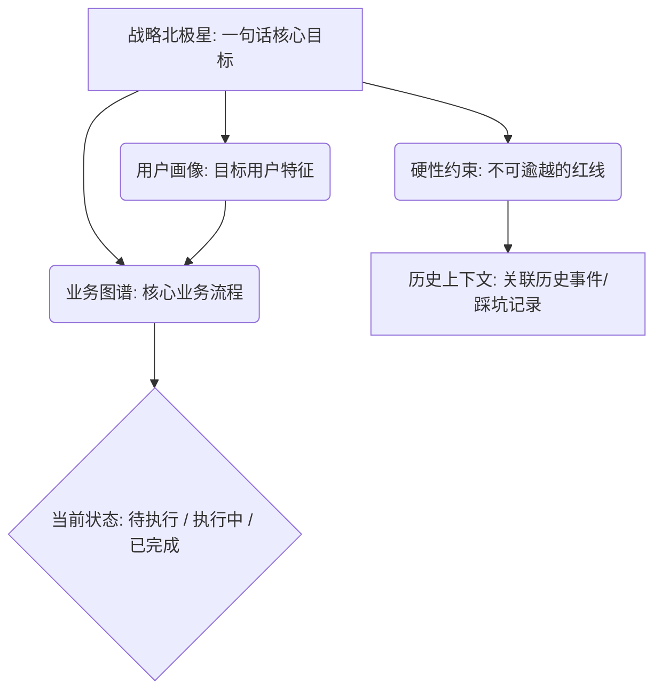
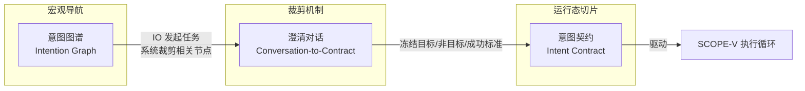

# 意图图谱：[项目名称]

**版本**: 1.0  
**状态**: DRAFT  
**创建日期**: YYYY-MM-DD  
**关联**: 将从中裁剪出单次任务的 Intent_Contract  

---

## 说明

意图图谱是 Agentic Agile 3-4-3 架构中的**宏观导航地图**。它不是线性的 Product Backlog，而是机器可解析的三维向量知识库。IO（意图主理人）通过多模态模糊注入（文本、草图、会议纪要），由系统自动构建。

当某一特定任务被澄清并准备执行时，系统从全局图谱中**冻结并裁剪**出一份极度收敛的**意图契约（Intent Contract）**，作为该次动作的唯一执行基准。

---

## 图谱结构



---

## 1. 战略北极星

| 属性 | 值 |
|------|-----|
| 北极星指标 | [一句话：我们最终要达成什么？] |
| 衡量方式 | [如何量化？] |
| 时间窗口 | [何时验证？] |

---

## 2. 业务图谱

> IO 仅需注入非结构化输入，系统自动提取节点。

### 2.1 核心业务流程

[描述核心业务流，可用自然语言]

### 2.2 关键实体

| 实体 | 属性 | 关系 |
|------|------|------|
| [实体名] | [关键属性] | [关联实体] |

### 2.3 IO 原始注入（非结构化）

```
[粘贴 PRD 文本、会议纪要、白板照片描述等原始材料]
```

---

## 3. 硬性约束

| ID | 约束 | 来源 | 不可逾越？ |
|----|------|------|-----------|
| H-01 | [约束内容] | [法务/安全/业务] | 是/否 |

---

## 4. 用户画像

| 画像维度 | 描述 |
|----------|------|
| 目标用户 | [谁在用？] |
| 核心场景 | [什么情况下用？] |
| 痛点 | [解决什么问题？] |

---

## 5. 历史上下文

| ID | 事件 | 日期 | 教训/影响 |
|----|------|------|----------|
| HX-01 | [历史事件] | YYYY-MM-DD | [对当前的影响] |

---

## 6. 从图谱到契约：裁剪关系

下图展示了从宏观意图图谱到单次任务意图契约的裁剪过程：



### 裁剪规则

| 步骤 | 操作 | 产出 |
|------|------|------|
| 1 | IO 提出模糊意图 | 自然语言描述 |
| 2 | 系统从图谱检索相关节点 | 候选上下文集合 |
| 3 | 澄清对话：确认目标、非目标、边界 | 确定性阈值达标 |
| 4 | 冻结并裁剪 | **Intent_Contract.md** |
| 5 | 签署后进入 SCOPE-V 循环 | 任务执行 |

### 裁剪示例

| 意图图谱节点 | 裁剪到意图契约的位置 |
|-------------|---------------------|
| 战略北极星 → | §1 背景与目标 |
| 硬性约束 → | §2 非目标 + 约束矩阵 |
| 业务图谱 → | §3 输入输出契约 + §4 业务规则 |
| 用户画像 → | §4 边界条件 |
| 历史上下文 → | §6 未决事项与假设 |

---

## 7. 当前任务队列

| 任务 ID | 描述 | 关联图谱节点 | 状态 | 对应契约 |
|---------|------|-------------|------|----------|
| T-001 | [任务] | [节点] | 待裁剪 / 已裁剪 / 执行中 / 已完成 | Intent_Contract_T-001.md |

---

## 签署区

| 角色 | 签署人 | 日期 | 状态 |
|------|--------|------|------|
| IO（意图主理人） | _________ | ________ | **PENDING** |
| OA（编排架构师） | _________ | ________ | **PENDING** |

---

> **意图图谱是活的**：每次任务完成后，证据包中的风险、教训和指标会反哺回图谱，更新历史上下文和约束。
